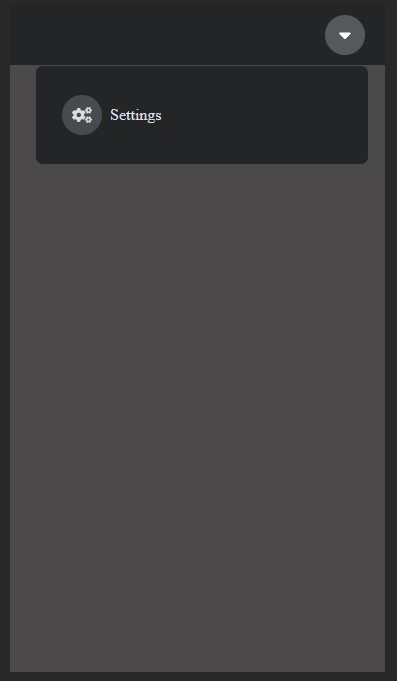
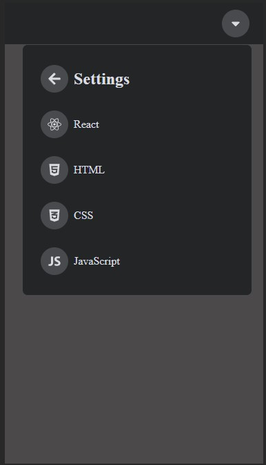

<!-- Improved compatibility of back to top link: See: https://github.com/othneildrew/Best-README-Template/pull/73 -->
<a name="readme-top"></a>
<!--
*** Thanks for checking out the Best-README-Template. If you have a suggestion
*** that would make this better, please fork the repo and create a pull request
*** or simply open an issue with the tag "enhancement".
*** Don't forget to give the project a star!
*** Thanks again! Now go create something AMAZING! :D
-->

<!-- PROJECT LOGO -->
<div align="center">
    <h1 align="center">Navbar with animation</h1>
    <a href="https://codesandbox.io/p/github/marcoliu1020/navbar-with-animation/main?file=%2F.codesandbox%2Ftasks.json&workspaceId=bc87caaa-1f72-4b4a-9759-089264ac06e3">View Demo</a>
</div>


<!-- ABOUT THE PROJECT -->
## About The Project





### Built With

- react
- react-icons
- react-transition-group


<!-- GETTING STARTED -->
## Getting Started

### Prerequisites

* npm
  ```sh
  npm install npm@latest -g
  ```

### Installation

1. Clone the repo
   ```sh
   git clone ...
   ```
2. Install NPM packages
   ```sh
   npm install
   ```